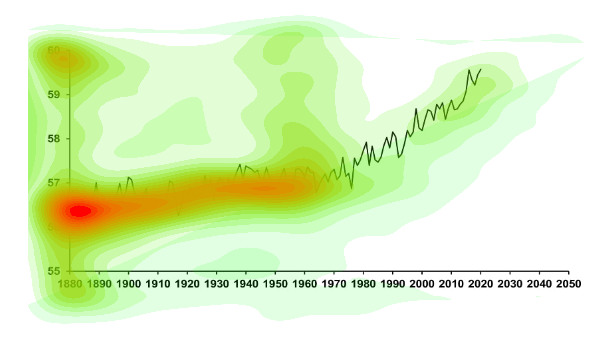
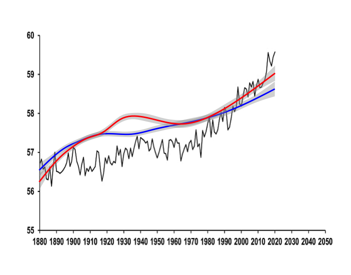

# Motivated Memory

A place to store code that was used for data analysis from my MA psychology at UBC. All identifying data sets have been placed in the .gitignore. The code that was used to create the experiments will be in another repo. 

## Bubble View 

We used a tool called [BubbleView](https://bubbleview.namwkim.org) which is an alternative methodology for eye tracking using discrete mouse clicks. This allowed up to measure which information people consciously chose to examine. In our experiments, the experimental group were told that the underlying graph was about climate change while the control group was told it was a graph about some change in value.

As you can imagine, the data that gets saved in the backend is extremely messy. It only contains n rows (where n is the sample size) but up to 600 columns. It was very wide, after columns that captured the subject number, time, condition, time spent in total, x coordinate of the mouse, y coordinate of the mouse, and the time spent on that one location. This x, y, time columns go on repeatedly, creating three new columns for every new mouse point until the participants movement ends. 

An example of the BubbleView data can be found here: https://github.com/andr3wli/mem1_test/blob/main/data/bubble_xyt.csv (you will need to view it raw).

I was able to transform the data so that it was tidy and we were able to generate the "average" heat map for each condition. The clean data can be found here: https://raw.githubusercontent.com/andr3wli/mem1_test/refs/heads/main/clean_data/tidy_bubble_data.csv.

    
    

## Redraw the plot 

After viewing the plot through BubbleView, the participants will answer some questionnaires and eventually be asked to redraw the plot from memory. We then recreate the line that the participants drew (our sample size was between 300-500) and we were able to create the "average" line. The blue line represents those that identify as liberals and the red represents those that identify as conservatives.  

Similarly, the data for this is extremely messy and wide again. The messy data looks like the messy data found in the BubbleView data. An example of the redraw data can be found here: https://github.com/andr3wli/mem1_test/blob/main/data/draw_xyt.csv (you will need to view it raw).

    
    

